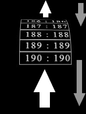

# 3D-finity-time-wheel--v2
 
# 1
 
Чистая функция touchmove - пригодная для переиспользования, без доп. логики
 
# 2
 
Добавлены функции реднера и реализована бесконечность.
 
Бесконечный 3d барабан выбора времени сеанса с возможностью голосового поиска (принимает данные и прокручивает до выбранной позиции).
Технически рассчитан на бесконечное число элементов.
(только для touch !)
 
# 3
 
 
# 2 и 3 требуют рефакторинга и чистки кода. В скором времени почищу.
 
Аналогично второму, только убраны ограничения на начало и конеч. Барабан зациклен.

